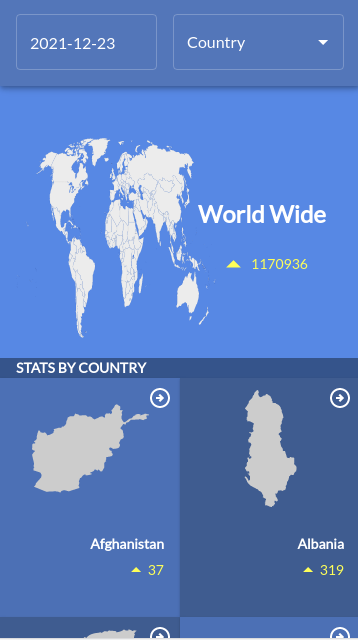
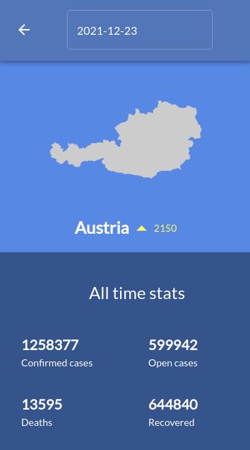
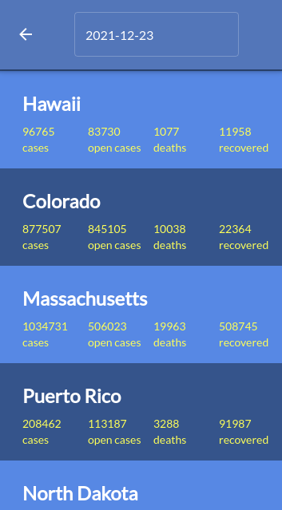

[](https://app.netlify.com/sites/covid-19-tracker-amrhub/deploys)

# COVID-19 Tracker

> Mobile web app that Keeps track of COVID-19 in 190+ countries

> |                     Home Page                      |                      Details Page                      |                 Details (Region stats)                 |
> | :------------------------------------------------: | :----------------------------------------------------: | :----------------------------------------------------: |
> |  |  |  |

This is a mobile app that allows you to search by date and get all stats of each country (today confirmed, open, deaths,and recovered cases), you could also search by country name with a certain date to get all country stats and regions stats (if exists).
These stats are based on since `Jan. 23rd, 2020` till that chosen date

## Built With

- JavaScript, HTML, and CSS3
- React, Redux, Material UI, Jest, and React Testing Library
- Vite: building tool, [Narrativa API](https://covid19tracking.narrativa.com/index_en.html)

## Live Demo

[Live Demo Link](https://covid-19-tracker-amrhub.netlify.app/) <br>
[Project overview](https://youtu.be/Ea-nHHvOlmk)

## Getting Started

To get a local copy up and running follow these simple example steps.

Simply click on `Code` drop down menu should appear then `download ZIP` after extraction you could follow `Usage` step

### Prerequisites

`Node.js`
<br> or <br>
`yarn`

### Setup

###### Do this step if you didn't download as ZIP, if you did, skip to next step please

to setup the project on your local, run these commands

```shell
git clone https://github.com/Amrhub/COVID19-tracker.git

cd COVID19-tracker  // to open the project
```

### Install

```shell
    npm install // to install all dependencies
    or
    yarn install
```

### Usage

```shell
    npm run dev // to open local host
    or
    yarn  dev
```

### Run tests

```shell
    npm test
    or
    yarn test
```

## Authors

👤 **Amr Ahmed**

- GitHub: [@Amrhub](https://github.com/Amrhub)
- LinkedIn: [Amr Ahmed](https://linkedin.com/in/amr-abdelrehim-ahmed)

## 🤝 Contributing

Contributions, issues, and feature requests are welcome!

Feel free to check the [issues page](../../issues/).

## Show your support

Give a ⭐️ if you like this project!

## Acknowledgments

- [Regis Freyd](https://github.com/djaiss) used his [mapsicon repo](https://github.com/djaiss/mapsicon) to display different countries provinces
- Original design idea by [Nelson Sakwa on Behance](https://www.behance.net/sakwadesignstudio)

## 📝 License

This project is [MIT](./MIT.md) licensed.
